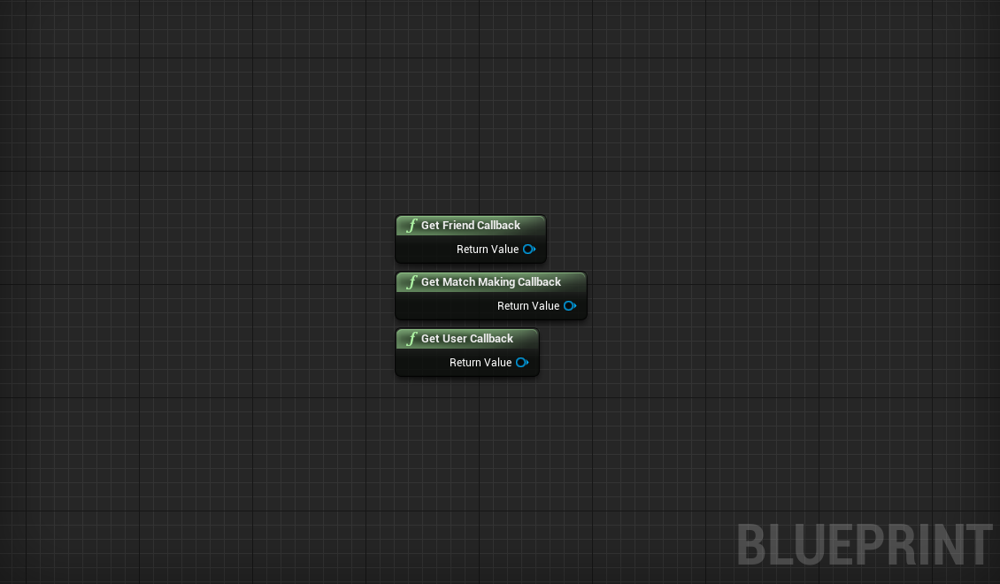
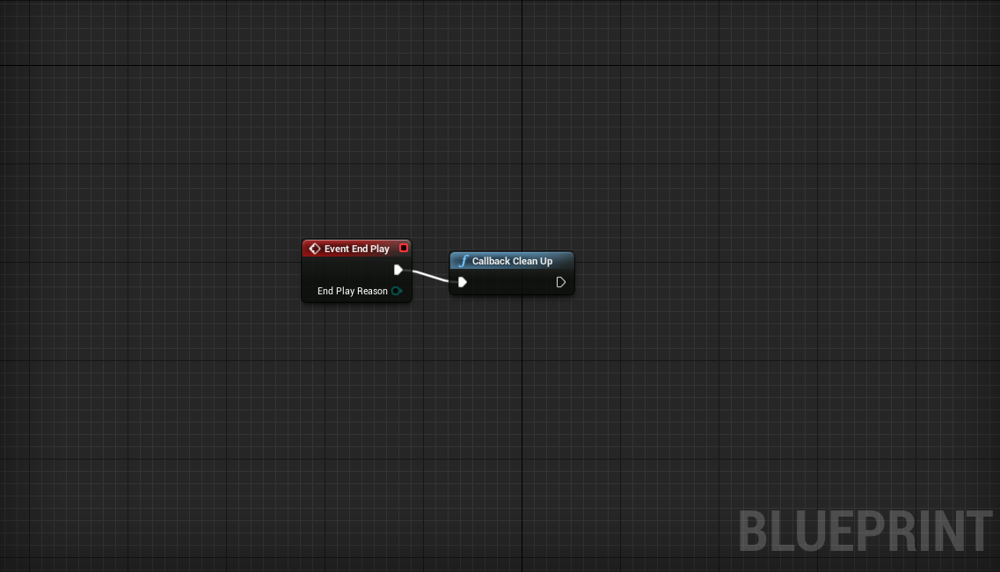
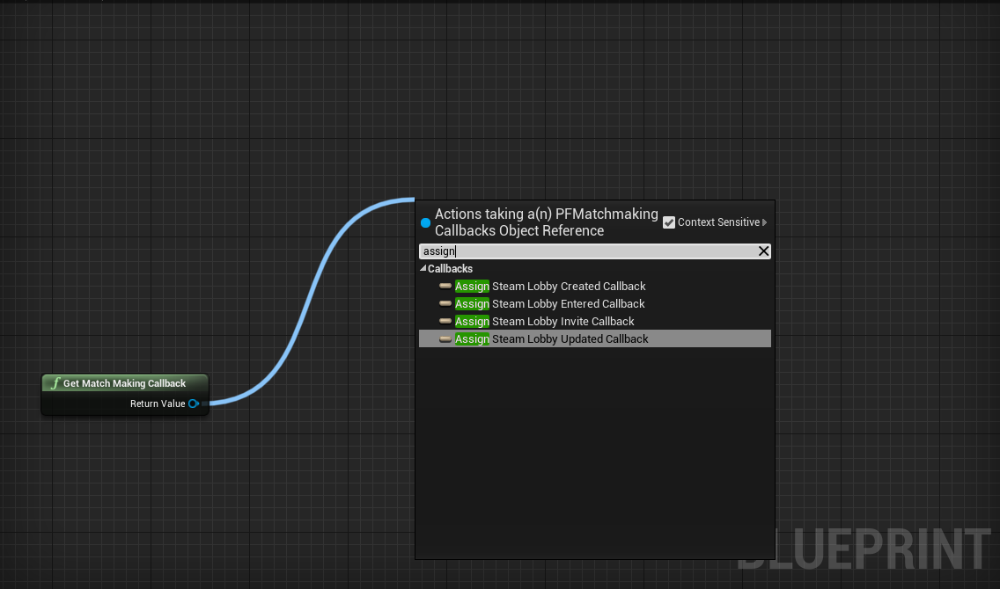
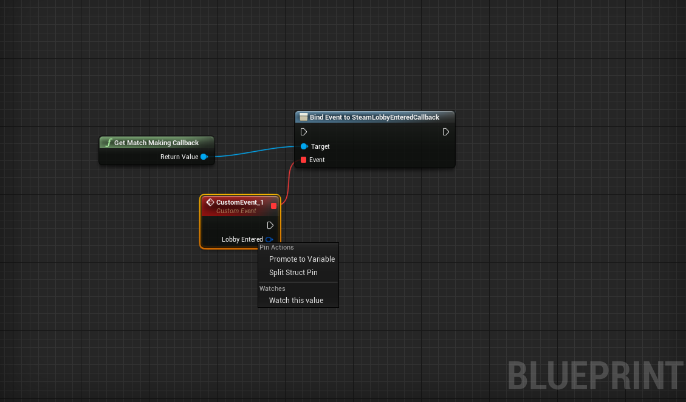
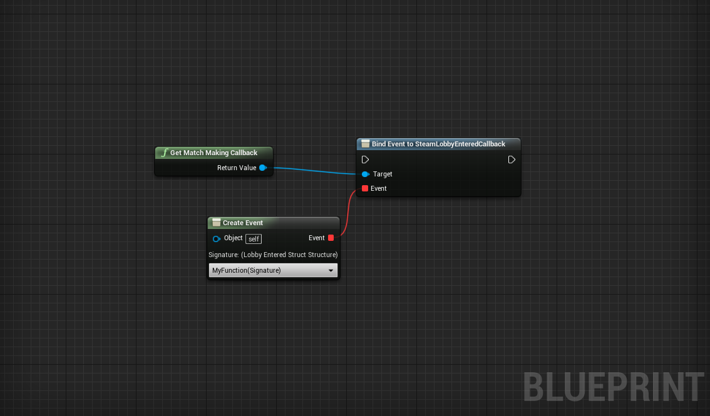
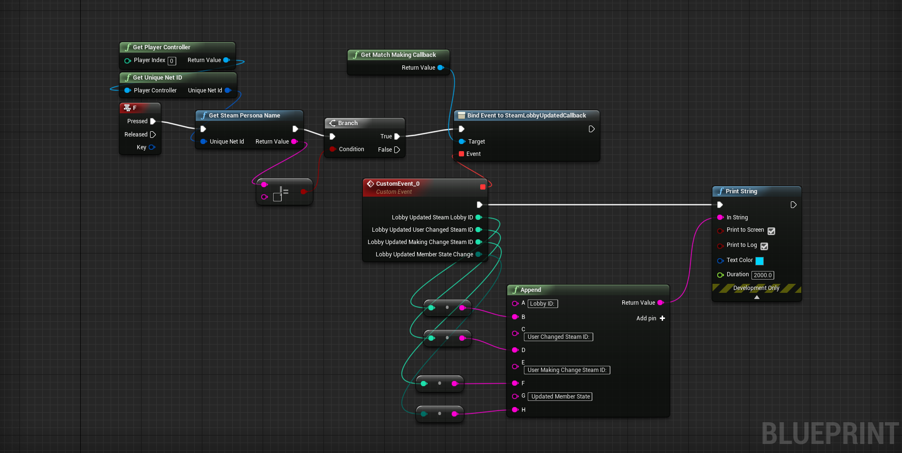

**************
Getting Started
**************

Enabling Steam Subsystem
========================
| Before this plugin can be used the Steam Subsystem must be enabled and active. If you are using blueprints I would highly recommend another free plugin to enable advanced steam functions `AdvancedSessions`_ along with `AdvancedSteamSessions`_. Most of the features of this plugin only work after the game is built and wrapped with Steam. I assume some features work with app id 480, but for all the features to be in full effect I advise using your own steam app id.

.. _AdvancedSessions: https://forums.unrealengine.com/community/community-content-tools-and-tutorials/41043-advanced-sessions-plugin
.. _AdvancedSteamSessions: https://forums.unrealengine.com/community/community-content-tools-and-tutorials/41043-advanced-sessions-plugin

Referencing Callback Object
==========================
| There are four callback objects which contain events that can be assigned
| **Friend**, **Matchmaking**, **User**
| They all contain unique events which can be seen later in this documentation.
| **To obtain a reference to one of these objects use the static function:**
| ``Get (Name of Object) Callback``

| This will return a reference to the object type specifed in the funtion.
| On the first call of Get (Name of Object) Callback an Actor will be created in the scene named PSCallbackCleanUpActor.
| This actor can be ignored it is just created for storage you will never need to reference it.

Cleanup
================

| In order to prevent unwanted memory leaks, the function CallbackCleanUp should be called before the game ends

Assigning Events
===================

.. centered:: **Finding Callbacks**
| To assign an event first drag a node from a referenced callback object out. Type "Assign" for unreal to display all available callbacks then select the callback you wish to choose. This will create a Bind Event to node.

.. centered:: **Assigning Callbacks to Custom Events**

| Drag the red node out from the Bind Event node and select Add Event -> Add Custom Event to assign the callback to an event. If the callback returns a struct (dark blue node) you can right click it to 'Split Struct Pin'

.. centered:: **Assigning Callbacks to Functions**
| Drag the red node out from the Bind Evet node and select Event Dispatchers->Create Event. This will create a Create Event node which you can use to find the event to a function. To do this you must create a function matching the "Signature:" on the Create Event node. Then use the drop down to select your function and bind the event.

.. centered:: **Preventing Crashes**

| Before events can be assigned the **Steam Subsystem must be enabled and active or the game WILL crash.** A way to determine if Steam is active in blueprints is to use the AdvancedSessionsSteam plugin function ``GetSteamPersona`` if the function returns empty then do not bind events: 

| In C++ determining if Steam is active is as simple as checking that the Steam Subsystem is not null:
.. centered:: ``if (IOnlineSubsystem::Get("Steam")) {}``				

Useful References
================

| `Steamworks Documentation`_
| `Github Source`_

.. _Steamworks Documentation: https://partner.steamgames.com/doc/home
.. _Github Source: https://github.com/da772/UE4_SteamworksCallbacks

