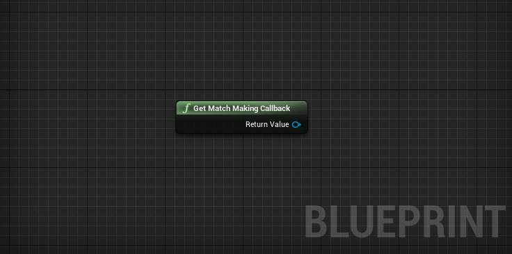
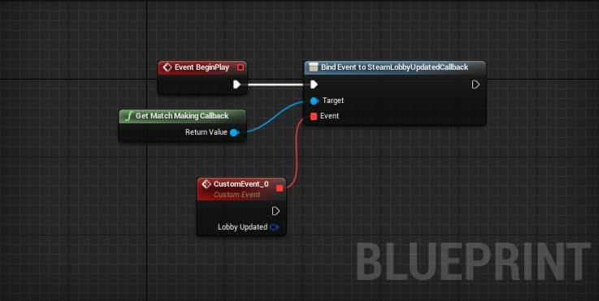
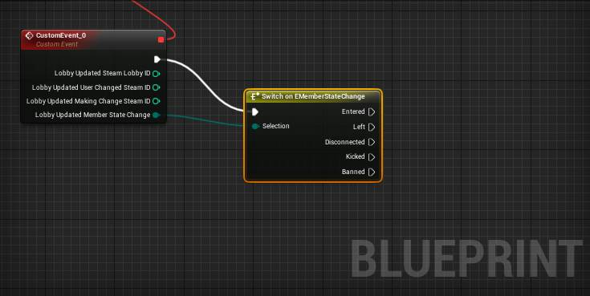
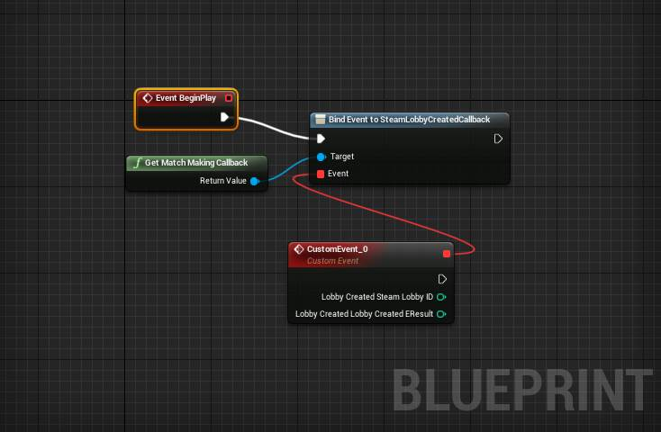
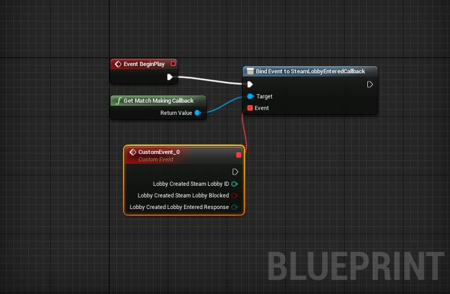
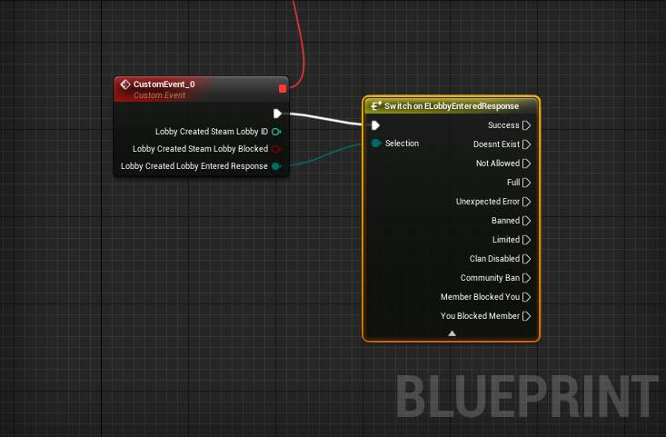
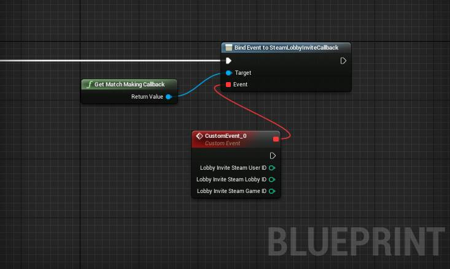

************
Steam Matchmaking Callbacks
************
GetMatchmakingCallback
=====================
.. centered:: Get reference to Matchmaking Callback Object to assign callback events.

.. list-table:: Returns **PFMatchmakingCallbacks**
   :widths: 25 25 50
   :header-rows: 1
   :align: center

   * - Name
     - Type
     - Description

   * - Return Value
     - PFMatchmakingCallbacks
     - Pointer to matchmaking callback handler.

SteamLobbyUpdatedCallback
==================
.. centered:: The lobby room state has changed, usually sent when a user has joined or leaves the lobby.

.. list-table:: Returns **FLobbyUpdatedStruct**
   :widths: 25 25 50
   :header-rows: 1
   :align: center

   * - Name
     - Type
     - Description

   * - SteamLobbyID
     - Integer
     - Steam ID of the lobby.

   * - UserChangedSteamID
     - Integer
     - Steam ID of the user who's status has changed.

   * - MakingChangeSteamID
     - Integer
     - Steam ID of user who made the change.

   * - MemberStateChange
     - `EChatMemberStateChange <#echatmemberstatechange>`__
     - Field of EChatMemberStateChange.

EChatMemberStateChange
======================

.. list-table:: **EChatMemberStateChange**
   :widths: 25 25 50
   :header-rows: 1
   :align: center

   * - Name
     - Value
     - Description

   * - ChatMemberStateChangeEntered
     - Entered (0x0001)
     - The User has joined or is joining the lobby.

   * - ChatMemberStateChangeLeft
     - Left (0x0002)
     - The User has left or is leaving the lobby.

   * - ChatMemberStateChangeDisconnected
     - Disconnected (0x0004)
     - The User has disconnected from the lobby.

   * - ChatMemberStateChangedKicked
     - Kicked (0x0008)
     - The User has been kicked.

   * - ChatMemberStateChangeBanned
     - Banned (0x0010)
     - The User has been kicked or banned.

SteamLobbyCreatedCallback
==================
.. centered:: Result of a request to create a Lobby. Lobby has been joined and is ready for use at this point.

.. list-table:: Returns **FLobbyCreatedStruct**
   :widths: 25 25 50
   :header-rows: 1
   :align: center

   * - Name
     - Type
     - Description

   * - SteamLobbyID
     - Integer
     - Steam ID of the lobby.

   * - SteamLobbyResult
     - (Integer) `EResult`_.
     - result of the operation as an integer of EResult.

.. _EResult: https://partner.steamgames.com/doc/api/steam_api#EResult

SteamLobbyEnteredCallback
==================
.. centered:: Result of entering a lobby.

.. list-table:: Returns **FLobbyEnteredStruct**
   :widths: 25 25 50
   :header-rows: 1
   :align: center

   * - Name
     - Type
     - Description

   * - SteamLobbyID
     - Integer
     - Steam ID of the lobby.

   * - SteamLobbyBlocked
     - bool
     - When true only invited users may join.

   * - LobbyEnteredResponse
     - `ELobbyEnteredResponse <#elobbyenteredresponse>`__
     - Response to determine if lobby was entered successfully.

ELobbyEnteredResponse
======================

.. list-table:: **ELobbyEnteredResponse**
   :widths: 25 25 50
   :header-rows: 1
   :align: center

   * - Name
     - Value
     - Description

   * - EResponse_Success
     - Success (1)
     - Successful entry to chat/lobby.

   * - EResponse_DoesntExist
     - DoesntExist (2)
     - Lobby/Chat doesn't exist (maybe closed).

   * - EResponse_NotAllowed
     - NotAllowed (3)
     - Do not have permission to join.

   * - EResponse_Full
     - Full (4)
     - Chat/Lobby room is full.

   * - EResponse_UnexpectedError
     - UnexpectedError (5)
     - UnexpectedError.

   * - EResponse_Banned
     - Banned (6)
     - The User has been banned from this lobby/chat and cannot join.

   * - EResponse_Limited
     - Limited (7)
     - Cannot join this lobby because the user is limited.

   * - EResponse_ClanDisabled
     - ClanDisabled (8)
     - Attempt to join a chat when clan chat is locked or disabled.

   * - EResponse_CommunityBan
     - CommunityBan (9)
     - Cannot join this chat/lobby because the user is banned from the community

   * - EResponse_MemberBlockedYou
     - MemberBlockedYou (10)
     - Cannot join this chat/lobby because a member in this chat/lobby blocked you.

   * - EResponse_YouBlockedMember
     - YouBlockedMember (11)
     - Cannot join this chat/lobby because the user has blocked a user already in the chat/lobby

SteamLobbyInviteCallback
==================

.. centered:: When an invite to join a lobby has been recieved.

.. list-table:: **returns FSteamLobbyInvite**
   :widths: 25 25 50
   :header-rows: 1
   :align: center

   * - Name
     - Type
     - Description

   * - SteamUserID
     - integer
     - Steam ID of the person who sent the invite.

   * - SteamLobbyID
     - Integer
     - Steam ID of the lobby we're invited to.

   * - SteamGameID
     - Integer
     - Game ID of the lobby we're invited to.