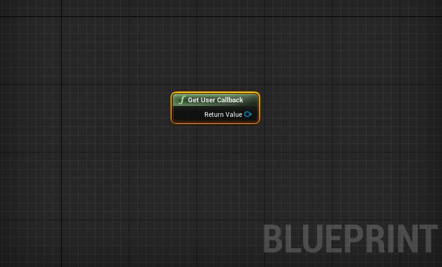
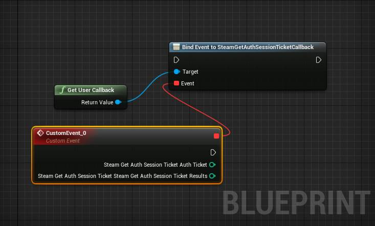
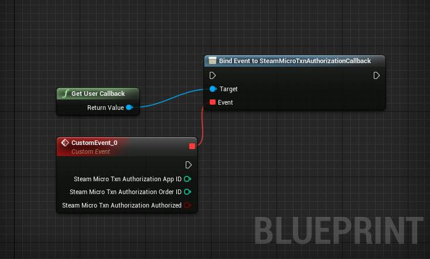
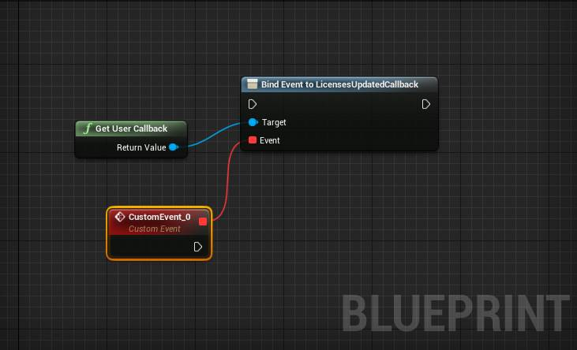
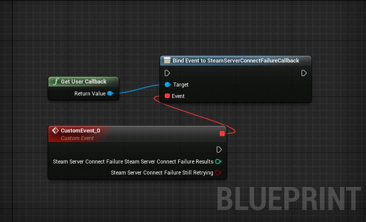
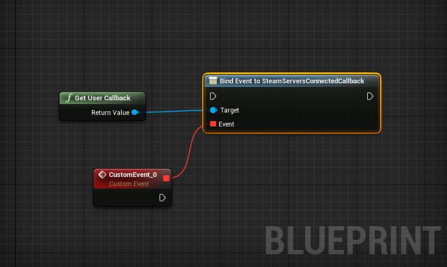
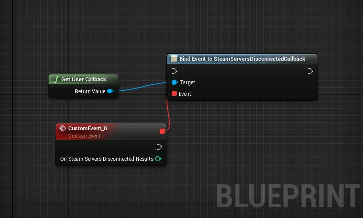

************
Steam User Callbacks
************
GetUserCallback
=====================
.. centered:: Get reference to User Callback Object to assign callback events.

.. list-table:: Returns **PFUserCallbacks**
   :widths: 25 25 50
   :header-rows: 1
   :align: center

   * - Name
     - Type
     - Description

   * - Return Value
     - PFUserCallbacks
     - Pointer to user callback handler.

SteamGetAuthSessionTicketCallback
==================
.. centered:: Called when cerating an auth session ticket.

.. list-table:: Returns **FSteamGetAuthSessionTicket**
   :widths: 25 25 50
   :header-rows: 1
   :align: center

   * - Name
     - Type
     - Description

   * - AuthTicket
     - Integer
     - id of ticket created.

   * - SteamGetAuthSessionTicketResults
     - (Integer) `EResult`_.
     - result of the operation as an integer of EResult.

.. _EResult: https://partner.steamgames.com/doc/api/steam_api#EResult

SteamMicroTxnAuthorizationCallback
======================
.. centered:: Called when a user has responded to a microtransaction authorization request.

.. list-table:: **FSteamMicroTxnAuthorization**
   :widths: 25 25 50
   :header-rows: 1
   :align: center

   * - Name
     - Type
     - Description

   * - AppID
     - Integer
     - App ID for the microtransaction.

   * - OrderID
     - Integer
     - Order ID provided for the microtransaction.

   * - bAuthorized
     - bool
     - Did the user authorize the transaction.

LicensesUpdatedCallback
==================
.. centered:: Called whenever the users licenses (owned packages) changes.

.. centered:: This callback has no return fields.

SteamServerConnectFailureCallback
==================
.. centered:: Called when a connection attempt has failed.

.. list-table:: Returns **FSteamServerConnectFailure**
   :widths: 25 25 50
   :header-rows: 1
   :align: center

   * - Name
     - Type
     - Description

   * - SteamGetAuthSessionTicketResults
     - (Integer) `EResult`_.
     - result of the operation as an integer of EResult.

   * - bStillRetrying
     - bool
     - Is steam client still trying to connect to the server?

.. _EResult: https://partner.steamgames.com/doc/api/steam_api#EResult

SteamServersConnectedCallback
==================
.. centered:: Called when a connection to the Steam back-end has been established.

.. centered:: This callback has no return fields.

SteamServersDisconnectedCallback
==================
.. centered:: Called if the client has lost connection to the Steam servers.

.. list-table:: Returns **OnSteamServersDisconnectedResults**
   :widths: 25 25 50
   :header-rows: 1
   :align: center

   * - Name
     - Type
     - Description

   * - OnSteamServersDisconnectedResults
     - (Integer) `EResult`_.
     - result of the operation as an integer of EResult.

.. _EResult: https://partner.steamgames.com/doc/api/steam_api#EResult

